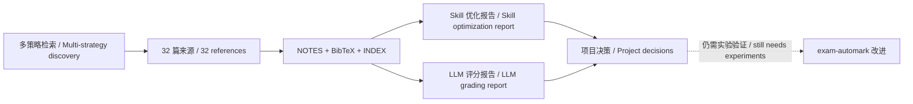

# TASK4 sci-brain 调研口头讲解稿 / TASK4 sci-brain Survey Oral Briefing

## 先说最重要的结论 / The most important conclusion

2026-07-19 的 sci-brain 工作完成了两份研究背景报告：

1. `skill_optimization_survey`：自动优化 prompt、skill 和多阶段 LLM 程序的方法；
2. `llm_grading_survey`：自动作文评分、短答案评分、LLM rubric 评分、人机协作和手写多模态评分。

这次提交本身只增加了调研材料，没有修改评分代码，也没有运行学生评分实验。因此，正确说法是：

> 调研给出了设计依据和后续改进方向；它不是“已经提高评分准确率”的实验结果。

The 2026-07-19 sci-brain work produced two research-background reports:

1. `skill_optimization_survey`: automated optimization of prompts, skills, and multi-stage LM programs;
2. `llm_grading_survey`: automated essay scoring, short-answer grading, rubric-conditioned LLM grading, human-in-the-loop workflows, and multimodal handwritten grading.

The survey commit added research artifacts only. It did not modify grading code or run student-grading experiments. The accurate claim is:

> The surveys provide design evidence and future directions; they are not experimental proof of improved grading accuracy.

## sci-brain 实际做了什么 / What sci-brain actually did



本次运行按 `/survey → /download-ref → /survey-writer` 组织：

- 先从多个检索方向建立文献范围；
- 再把来源整理成 `.knowledge/NOTES.md`、`INDEX.md` 和 `references.bib`；
- 最后把 14 篇 skill 优化文献和 18 篇评分文献写成两份报告；
- 两份报告共使用 32 个 cite key，当前检查没有缺失引用。

运行时没有专门的 arXiv、Semantic Scholar 或 CrossRef MCP，所以发现阶段使用了 WebSearch 风格检索和可见 arXiv ID。报告中的 Page/PEG 历史信息也明确标成了 `needs verification`。

The run followed `/survey → /download-ref → /survey-writer`: discovery, knowledge-base construction, and report writing. Fourteen references support the skill-optimization report and eighteen support the grading report. All 32 cited keys currently resolve. Dedicated scholarly-search MCP tools were unavailable, so discovery relied on WebSearch-style search and visible arXiv identifiers.

---

## 报告一：自动 Skill 优化到底讲了什么 / Report 1: automated skill optimization

### 先理解“skill”是什么

这里的 skill 不是一句 prompt。对 exam-automark 来说，它是一份可执行、可版本化的评分规则包，包括：

- rubric 和评分政策；
- prompt 模板；
- 输入与输出 schema；
- 示例；
- 证据引用和反馈规则；
- 评估脚本；
- candidate 能否进入 held-out 或 main 的发布门槛。

因此，优化 skill 不是“让模型把 prompt 润色一下”，而是：

```text
发现具体错误
→ 提出一项可解释修改
→ 固定 development 数据和其他条件
→ 重新评分
→ 比较多项指标与具体题目
→ 人工决定接受、拒绝或修改
```

A grading skill is a versioned executable artifact, not one prompt sentence. It includes the rubric, prompt, schemas, examples, evidence and feedback rules, evaluation scripts, and promotion gates. Optimization should therefore be an auditable experiment rather than free-form rewriting.

### 方法一：离散 Prompt 与指令搜索

代表方法包括 APE、ProTeGi/APO 和 OPRO。

它们共同的做法是：

1. 保持模型参数不变；
2. 让模型生成或修改自然语言指令；
3. 在 development examples 上计算分数；
4. 保留表现更好的 candidate。

ProTeGi/APO 把错误总结称为“textual gradient”。它先描述当前 prompt 为什么错，再要求模型沿“相反语义方向”修改 prompt。

这正是我们理解 SkillOpt 失败的关键。Physics R4 的错误同时包含：

- 一些题评分过低，需要放宽；
- 一些题评分过高，需要收紧。

candidate 把这些相反方向的问题压成一条全局“更严格”的规则，结果修复了一类错误，却放大了另一类错误。问题不只是 candidate “没有通过”，而是 textual gradient 在生成前没有按题目、rubric 条款和误差方向拆分。

适合我们：

- 修改可读的评分规则；
- 生成清晰的 skill diff；
- 在小规模 dev set 上快速试验。

风险：

- dev set 过拟合；
- 只优化一个指标；
- 把相反错误合并；
- 生成听起来合理、但没有例子支持的反思。

Discrete prompt search is the family most closely related to the current SkillOpt work. The key lesson from Physics R4 is that contradictory under-scoring and over-scoring failures must not be collapsed into one global textual gradient.

### 方法二：连续或 Soft Prompt 优化

Prefix-tuning 和 prompt tuning 不直接修改自然语言，而是学习一组模型内部的向量。

优点：

- 在有大量标注和模型训练权限时，参数效率较高；
- 能直接用梯度优化。

为什么现在不适合我们：

- 导师和教师看不懂一个 embedding diff；
- 它通常绑定特定模型；
- 很难在 GitHub PR 中解释“为什么这样改”；
- 我们目前主要使用外部 CLI/API，没有底层参数训练权限。

所以它是重要的学术基线，但不应成为 exam-automark 当前路线。

Soft prompts learn vectors rather than readable instructions. They are useful research baselines but are currently a poor fit because they are model-specific, require training access, and are difficult for teachers to audit in a PR.

### 方法三：多阶段 LLM Program Optimizer

DSPy/MIPRO 不把系统看成一个大 prompt，而是多个模块：

```text
读取输入
→ 转录
→ 提取证据
→ 应用 rubric
→ 计算分数
→ 验证 schema
→ 生成反馈
```

它的价值是可以问：

- 是转录模块错了，还是评分模块错了？
- 哪个模块的 prompt 应该改？
- 修改某个模块后，下游指标是否改善？

这比把所有职责塞进一个 prompt 更适合我们的长期架构。MIPRO 的核心难题叫 credit assignment：最终分数错了，应该把责任归到哪一步？这也解释了为什么 TASK6 必须先建立错误阶段分类，TASK7 才能公平比较“直接多模态”和“先转录再评分”。

Program optimizers treat the application as coupled modules and optimize downstream metrics without requiring a label for every internal step. This is architecturally relevant to exam-automark, but it requires explicit stage-level error attribution.

### 方法四：Textual Gradient 与反思式演化

TextGrad 和 GEPA 都使用自然语言反馈改进系统组件。

- TextGrad 把 LLM 反馈沿计算图传回上游变量；
- GEPA 分析完整 trajectory，提出 prompt mutation，并保留不同优点组成的 Pareto frontier。

“Pareto”在这里的意思不是只保留一个总分最高的 candidate，而是保留多种不可简单互相取代的候选，例如：

- candidate A 的 exact agreement 更好；
- candidate B 的 severe error 更少；
- candidate C 的反馈更可靠。

对我们最重要的借鉴是：不能用一个 accuracy 数字决定 skill 胜负。候选规则至少要同时看：

- exact agreement；
- subquestion MAE；
- total-score MAE；
- severe-error rate；
- per-question regression；
- schema validity；
- 错误是否通过总分抵消被隐藏。

Textual-gradient and reflective-evolution methods can turn qualitative failures into candidate edits. Their useful lesson is multi-objective selection; persuasive self-critique alone is not evidence.

### 方法五：Self-Refine、Reflexion 与 Skill Library

这类方法把一次运行中成功的经验保存下来，供以后复用。

对我们来说，可以保存的不是泛泛而谈的“下次更仔细”，而是有适用条件的规则，例如：

```text
如果：学生给出代数等价表达式
并且：rubric 接受等价形式
那么：不得因形式不同扣分
证据：哪些题、哪些 student case、改前改后指标
```

风险是 skill library 无限制增长后出现：

- 旧规则与新 rubric 冲突；
- 一门课的规则污染另一门课；
- 成功案例被错误泛化；
- 规则没有测试却被自动加入生产 skill。

因此，经验必须有适用范围、来源案例、版本和回归测试。

Reflection and skill libraries are useful only when each lesson has scope, evidence, versioning, and regression tests. Uncurated memory can preserve stale or contradictory advice.

---

## 报告二：LLM 自动评分到底讲了什么 / Report 2: LLM-based grading

### 路线一：传统自动作文评分（AES）

传统 AES 常用长度、语法、词汇、结构和主题相关性等特征预测作文分数。

它的警告是：这些表面特征可能和历史分数相关，却不等于真正理解内容。模型可能奖励：

- 写得更长；
- 语言更流利；
- 结构更像标准答案；
- 表达方式更接近模型自己的风格。

因此，在 exam-automark 中，语言流利度不能替代 rubric 证据。

Classical automated essay scoring shows why correlation with surface features is not enough to establish construct validity.

### 路线二：自动短答案评分（ASAG）

短答案评分关注语义等价、部分分和具体知识点。传统方法使用词重叠、语义相似度、聚类或分类器；后来的方法使用 transformer 和 LLM。

对我们有两个启示：

1. 简单、确定性的特征仍可作为 baseline 或检查器；
2. 总分不是最小分析单位，必须看到 rubric item 或 subquestion。

ASAG is directly relevant to rubric-item grading. Deterministic similarity or validation features can remain useful alongside LLM judgments.

### 路线三：直接 LLM Rubric Grader

LLM 可以读 rubric、参考答案和学生回答，然后输出分数和反馈。

文献结果并不矛盾，而是说明适用条件不同：

- 在范围窄、低风险、标签清楚的 formative task 上，模型可能接近专家；
- 跨数据集、跨学科、复杂部分分或高风险场景下，表现会明显下降；
- prompt、模型、题型和评分尺度改变后，结果不能直接迁移。

所以正确结论不是“LLM 能评分”或“LLM 不能评分”，而是：

> 必须对某一个固定 assessment、rubric、model、input mode 和 skill 做可复现实验。

Direct LLM graders can perform well in bounded settings, but their reliability does not automatically transfer across courses, rubrics, models, or modalities.

### 路线四：LLM-as-a-Judge 与偏差

LLM judge 会受到与真正质量无关的因素影响，例如位置、篇幅、表达流利度或与模型自身回答风格的相似度。

这和本周导师强调的“非主观因素”直接相关。我们需要测试：

- 输入顺序变化是否改变判断；
- 只改变格式或长度是否改变分数；
- 相同数学内容用不同等价形式是否得到相同分数；
- 模型是否因手写清晰度、OCR 或排版而把读取错误当成知识错误。

因此，TASK6 的错误 taxonomy 不能只写“模型判断错”，而要记录可操作的非主观原因。

LLM-as-a-judge research motivates counterfactual and invariance tests for position, verbosity, formatting, equivalent expressions, and other non-rubric factors.

### 路线五：Human-in-the-Loop

人机协作不是“AI 先打分，老师随便看一下”，而是明确哪些情况必须转人工：

- 转录不确定；
- rubric 本身有歧义；
- 低 confidence；
- severe score impact；
- 模型多次结果不一致；
- 反馈与证据不一致。

2026 年的手写数学工作流把扫描、匿名化、多次评分、一致性检查和强制人工确认组成完整流程；其价值是节省工作量，同时用流程把偶发错误限制住，而不是宣称模型永远正确。

Human-in-the-loop grading requires explicit routing rules. Human review is a containment mechanism for uncertain, ambiguous, inconsistent, or high-impact cases.

### 路线六：手写多模态评分

这是对我们最重要的一条。

直接多模态路径：

```text
原始图片 → vision model 同时读取并评分
```

先转录路径：

```text
原始图片 → 转录 → text grader 评分
```

两条路径都要做，因为它们回答不同问题：

- 直接多模态测试端到端能力，但读取和评分错误可能混在一起；
- 先转录便于审计文字输入，但可能丢失图、布局和符号关系；
- 如果只比较最终分数，就不知道差异来自视觉识别还是 rubric 决策。

Levine 等人的 2026 手写数学研究中，最佳模型的大多数错误（87%）来自转录失败，而不是 rubric 误用。这并不证明所有课程也是 87%，但它证明了“转录错误”和“评分错误”必须分开记录。

Multimodal and transcript-first paths must both be evaluated. End-to-end score differences alone cannot identify whether the failure arose from perception or rubric application.

---

## 四个容易混淆、但必须会讲的概念 / Four concepts that must not be confused

### 1. Agreement 不等于 Validity

Agreement 是模型分数和历史教师分数是否一致。

Validity 是这个分数是否真的测到了课程想考察的能力。

如果教师历史评分本身有噪声，或者模型只是奖励语言流利度，高 agreement 仍然不代表有效评分。

Agreement measures similarity to labels; validity asks whether the intended knowledge or skill is actually being assessed.

### 2. 总分正确不等于逐题正确

一个题多给 2 分、另一个题少给 2 分，总分误差是 0，但两个判断都错了。这就是 error cancellation。

因此必须同时报告 total-score 和 item-level 指标。

A correct total can hide equal and opposite item-level errors. Total-score metrics must be paired with rubric-item metrics.

### 3. Confidence 不等于 Calibration

模型说 `high confidence` 只是一个声明。

只有当 high-confidence 样本确实比 low-confidence 样本更常正确，这个 confidence 才有用。还要检查：

- 每档有多少样本；
- 每档真实准确率；
- 错误是否集中在模型自称不确定的样本；
- 模型是否会“很自信地错”。

Confidence is a label; calibration is the empirical relationship between that label and observed correctness.

### 4. 正确分数不等于安全反馈

模型可能碰巧给对分数，却用错误理由解释；也可能分数错了，但反馈听起来非常有说服力。

因此 marks 和 feedback 必须分开评价。

Correct marks do not guarantee grounded or safe feedback. Score quality and feedback quality require separate evaluation.

---

## 我们项目实际上已经有什么 / What the project actually has

这些能力在 sci-brain 报告提交前已经存在，不能说成是调研后新实现的：

- versioned skill snapshots；
- experiment plan、record、prompt packet 和 hash；
- development / held-out 区分；
- 严格输出 schema；
- 隐私与匿名化检查；
- exact agreement、MAE、severe-error、per-question 等指标；
- readiness gate。

报告提交后，项目又增加了 advisor 自动运行/提交 skill、更多 negative-result 分析和来源健康检查。但目前没有证据证明这些都是 sci-brain 报告直接导致的，因此更诚实的说法是：

> 调研为已有设计提供了文献依据，并帮助我们识别下一步缺口；它没有独占这些设计的来源。

Several foundations already existed before the survey commit. Later project additions are compatible with the survey recommendations, but should not automatically be attributed to the survey without evidence.

## 还没有完成的关键缺口 / Key gaps that remain

- 没有统一的阶段级错误 taxonomy；
- confidence 目前只有分档正确率，还没有完整 calibration 分析；
- 直接多模态和先转录路径还没有在同一受控协议下完成四模型比较；
- candidate promotion 还没有统一的多目标 release gate；
- 没有系统测量 human-human agreement；
- feedback 正确性还没有独立 benchmark；
- 人工 review routing 规则还没有成为统一输出；
- literature survey 没有记录当时使用的 sci-brain commit，不能完整复现工具版本。

## 本次调研材料自身的不足 / Limitations of the survey artifacts

1. 调研提交只增加文档，没有验证建议能否提高 exam-automark 的真实结果。
2. run manifest 记录了 sci-brain 仓库 URL，但没有记录运行时 commit。当前本机 checkout 是 `c0ae259df4dc351896b319f9d44b4e4c94308f04`，但不能反推 2026-07-19 一定用了同一 commit。
3. 检索策略名称和 arXiv ID 已记录，但没有保存完整 query、候选排除理由和每个结论的证据摘录。
4. 完整论文缓存被设计为不提交；新 checkout 只能看到 `INDEX`、`NOTES` 和 BibTeX，不能仅靠 Git 重建当时所有全文证据。
5. Page/PEG 历史信息仍待核实；两条 BibTeX 记录的出版元数据不完整。
6. 两份报告是英文技术报告，没有“导师问答式”教学层，也没有明确的 adopted / deferred / rejected 决策表。
7. 报告没有做新的 exam-automark 模型调用，所以任何项目建议都还需要后续实验确认。

## 你向导师汇报的 90 秒版本 / 90-second advisor summary

> sci-brain 这次产出了两份背景调研，一份研究自动优化 prompt 和 grading skill，一份研究 LLM 自动评分。Skill 优化方面，我们最重要的借鉴是把 skill 当成可版本化、可评估的程序，而不是一段随意修改的 prompt。优化必须从具体错误出发，在固定 dev set 上比较多个指标，并由人工决定是否进入 held-out。SkillOpt 失败也说明，过高分和过低分这种相反错误不能压成一个全局 textual gradient。
>
> 自动评分方面，文献说明窄任务上 LLM 可以接近人工，但跨课程、复杂部分分和手写场景仍有明显风险。我们必须区分图片读取、转录、证据提取和 rubric 评分错误；同时看逐题指标、严重错误、confidence calibration 和反馈正确性。直接多模态与先转录再评分两条路径都要跑，因为只看最终总分无法判断错误来自视觉还是评分规则。
>
> 这次调研本身没有提高准确率，它提供的是设计证据。项目原本已经有 skill 版本、实验记录、schema、隐私检查和多项指标；下一步要补的是统一错误 taxonomy、confidence calibration、双路径多模态比较和多目标 candidate 发布门槛。

> The sci-brain work produced two background reviews: automated skill optimization and LLM-based grading. The central lesson is to treat a grading skill as a versioned, testable program. Candidate changes must be grounded in concrete failures, evaluated on a frozen development split with multiple metrics, and promoted through human review. The SkillOpt failure further shows that opposite error directions must not be collapsed into one global textual gradient.
>
> The grading literature shows strong performance in some bounded tasks but substantial risk across courses, partial-credit rubrics, and handwritten inputs. We must separate perception, transcription, evidence extraction, and rubric-application errors; evaluate item-level errors, severe errors, confidence calibration, and feedback; and compare both direct-multimodal and transcript-first paths.
>
> The surveys did not improve accuracy by themselves. They provide evidence for the next engineering decisions.

## 关键来源 / Key sources

- [Automatic Prompt Optimization with “Gradient Descent” and Beam Search](https://arxiv.org/abs/2305.03495)
- [Optimizing Instructions and Demonstrations for Multi-Stage Language Model Programs](https://arxiv.org/abs/2406.11695)
- [TextGrad: Automatic “Differentiation” via Text](https://arxiv.org/abs/2406.07496)
- [GEPA: Reflective Prompt Evolution Can Outperform Reinforcement Learning](https://arxiv.org/abs/2507.19457)
- [A LLM-Powered Automatic Grading Framework with Human-Level Guidelines Optimization](https://arxiv.org/abs/2410.02165)
- [Large Language Models are not Fair Evaluators](https://arxiv.org/abs/2305.17926)
- [Evaluating GPT-4 at Grading Handwritten Solutions in Math Exams](https://arxiv.org/abs/2411.05231)
- [Human-in-the-Loop LLM Grading for Handwritten Mathematics Assessments](https://arxiv.org/abs/2603.13083)
- [Automated Grading of Handwritten Mathematics Using Vision-Capable LLMs](https://arxiv.org/abs/2605.19043)
