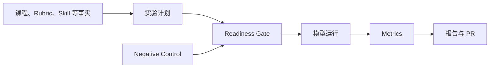

# TASK3 口头讲解稿：quantum.harness / beginner-training

你说得对。报告不是交差文件，你需要自己能讲出来。

## 先理解 quantum.harness 是什么

它不是一个模型，也不是一个普通运行脚本。

可以把它理解成一套“科研实验护栏”：它约束 AI agent 在做实验时，必须说明：

- 用了什么问题、数据和参数；
- 为什么选择这个方法；
- 运行前检查了什么；
- 如何证明检查真的有效；
- 结果来自哪次运行；
- 报告中的数字能不能追溯回原始结果。

它主要解决的是：**AI 能跑实验，但不能让它稀里糊涂地跑完，然后只给一个无法复现的结论。**



## 最重要的六个知识点

### 1. Single source of truth：唯一事实源

实验参数不能只存在聊天记录中。

例如“使用哪个模型、哪些学生、哪个 prompt”必须写进结构化文件。因为聊天上下文会丢失，也可能被模型错误回忆。

我们对应实现了：

- `ExperimentPlan`
- `ExperimentRecord`
- prompt packet `manifest.json`
- data、prompt、rubric、skill hash
- Git commit 和 split

导师问“借鉴了什么”，你可以说：

> 我们借鉴了结构化事实源的思想。现在实验配置不再依赖聊天记忆，而是由 plan、manifest 和 run metadata 固定下来。

### 2. Readiness gate：先检查，再花钱运行

在 quantum.harness 中，真正计算前必须确认 Hamiltonian、边界条件、系统大小等关键设置。

对应到阅卷项目，就是运行前检查：

- baseline 和 candidate 是否使用同一批学生；
- 是否使用同一份 rubric；
- development 和 held-out 有没有混用；
- prompt、skill 和数据版本是否正确；
- multimodal 图片是否通过隐私审核；
- 模型和登录状态是否可用。

我们的 `readiness.py`、advisor skill 的 `doctor → probe → plan → prepare` 就属于这种设计。

它的价值不是直接提高准确率，而是避免花钱跑完以后才发现实验不可比较。

### 3. Negative control：证明检查真的会失败

普通测试经常只证明“正确输入可以通过”。

Negative control 会故意放入错误输入，例如：

- 错误 rubric；
- 不匹配的学生集合；
- 非法 schema；
- 不存在的软件包；
- 泄露学生数据的公开报告。

预期结果必须是检查失败。

为什么重要？因为一个永远显示“passed”的检查没有意义。

我们已经有一些 negative-control 测试，但它们还只是本地测试。你选择的 B 就是以后在 TASK5 把它们接入 GitHub Actions，成为 main 的自动门槛。

### 4. 分离 Knowledge、Skill、Run、Report

quantum.harness 不把所有内容塞进一个 prompt：

- Knowledge：稳定的领域事实；
- Skill：怎么做事情；
- Run：这一次具体运行了什么；
- Report：给人看的派生结果。

我们对应的是：

| 上游概念 | 我们项目 |
|---|---|
| Knowledge | course spec、rubric、评分政策 |
| Skill | grading skill、advisor skill |
| Run | plan、packet、run metadata、outputs |
| Report | metrics、Markdown、Typst/PDF、PR |

这样修改 rubric 时，不需要重写运行工具；修改报告样式时，也不能偷偷改变实验事实。

### 5. Provenance：每个结果都要能追溯

报告写“准确率 90%”还不够，还要知道：

- 哪个模型；
- 哪个数据 split；
- 哪个 prompt；
- 哪个 skill；
- 哪次运行；
- 哪个 metrics 文件。

这叫 provenance，也就是结果的“来源链”。

你选择的 C 会在 TASK7 前建立最小的 run-to-report lineage：

```text
run metadata → metrics → report → PR
```

以后四模型比较时，可以证明每一行数据究竟来自 DeepSeek、Codex、Kimi 还是 Claude，以及使用文字转录还是直接多模态。

### 6. 只在关键决策处让用户确认

`beginner-training` 为了教学，每一步都会解释并等待确认。

我们不能全部照搬，因为导师希望自动化。如果每一步都问，运行仍然很麻烦。

所以我们做了适配：只在真正有风险的地方确认：

- 安装软件；
- 登录账号；
- 恢复私有数据；
- 调用真实模型；
- 发送学生内容；
- 从 development 进入 held-out。

其他稳定步骤自动完成，包括准备 packet、运行、验证、生成报告和创建 PR。

## beginner-training 的五条路线

你不需要记住全部细节，只需理解它逐步训练科研能力：

1. Setup：先确认工具可用。
2. Reproduce：先复现论文，不急着创新。
3. Survey：建立可靠的文献库。
4. Develop：按照 issue、设计、测试、review、PR 开发。
5. Go beyond：在已复现结果上做小型扩展。

每一条最后都有可信度检查，而不是“命令跑完就算成功”。

## 我们究竟改了什么

已经完成：

- 用 plan、manifest 和 hash 固定实验配置；
- 增加 readiness gate；
- 将 `Data/` 和公开报告分离；
- advisor skill 只在关键边界要求批准；
- 失败运行也会保存并提交；
- 修复乱码调研报告；
- 新增 `sources.json` 固定外部仓库 commit；
- 新增 UTF-8、乱码、floating `main` 自动检查。

已经决定但尚未完成：

- B：TASK5 添加 GitHub Actions 自动门槛；
- C：TASK7 前建立统一 lineage schema。

要诚实说明：

> 不是所有 plan、packet 和 hash 都是看完 quantum.harness 才从零创建的。有些结构原本已经存在。这次调研的贡献是把它们整理成统一的可复现实验原则，并发现还缺 CI、来源版本和报告追溯。

## 你向导师汇报的 60 秒版本

> quantum.harness 是一套约束 AI 做可复现实验的 harness。我们没有迁移它的量子物理、Julia 或集群工具，而是借鉴了结构化事实源、运行前 readiness gate、negative control、私有数据隔离和结果 provenance。
>
> 在 exam-automark 中，我们用 experiment plan、packet manifest、data/prompt/skill hash 固定实验条件；用 readiness check 防止不同学生、rubric 或 split 被错误比较；用 advisor skill 在私有数据、真实模型和 held-out 等关键边界请求批准；报告则从 metrics 和 run record 派生。
>
> 这次还发现旧调研报告乱码且没有固定上游版本，所以我们增加了 commit-pinned source manifest 和文档健康检查。下一步会在 GitHub Actions 中自动运行 negative controls，并在多模型实验前统一 run-to-report lineage。

这就是导师问“借鉴了什么、改了什么”时最完整且不夸大的答案。
